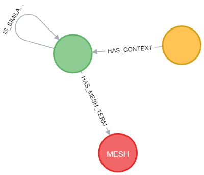
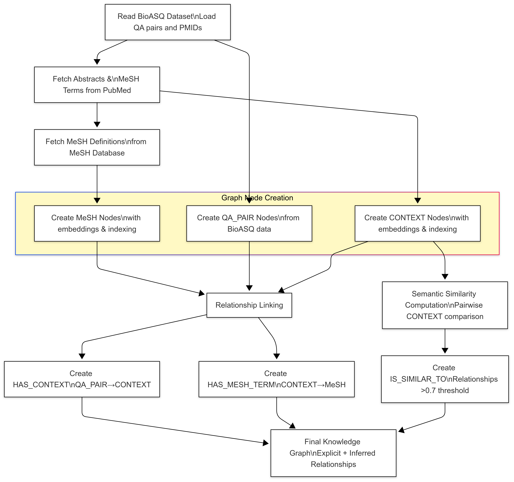
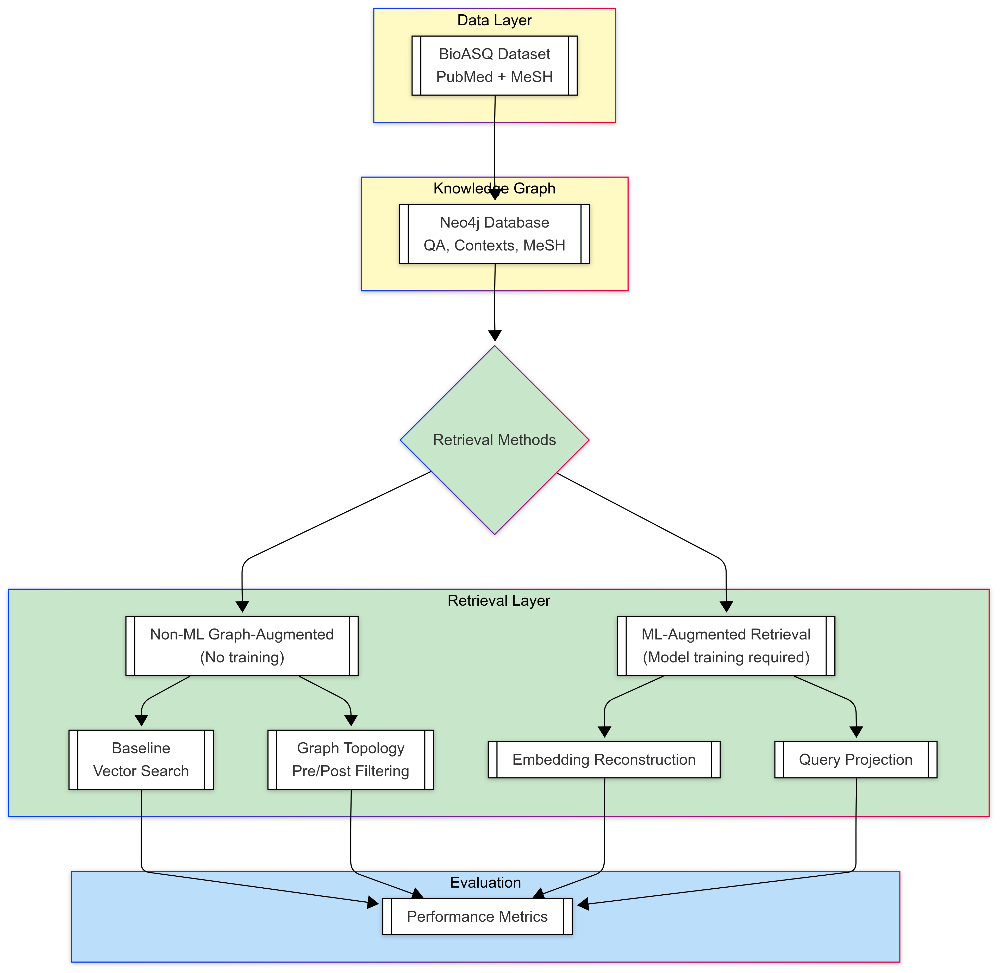
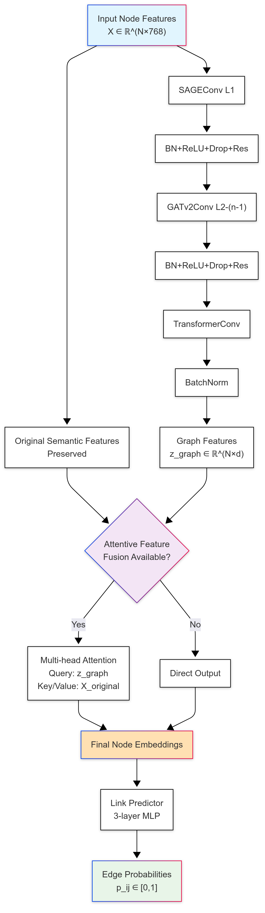

# Graph RAG Techniques
**AUTH Diploma Thesis Project**

A comprehensive research project implementing and evaluating various Graph Retrieval-Augmented Generation (RAG) techniques for biomedical question answering. This repository explores multiple approaches to enhance document retrieval using knowledge graphs, neural network models, and advanced graph algorithms.

## Project Scope

This repository implements and compares multiple graph-based retrieval techniques for biomedical question answering:

### **Core Techniques Implemented:**
1. **Traditional Graph RAG**: Basic semantic search with knowledge graph structure
2. **Neural Graph Projection Models**: 
   - Dual Projection Models with contrastive learning
   - Graph Attention Network (GAT) based projection
   - Models with attentive pooling and domain classification
3. **Graph Neural Networks (GNNs)**:
   - Graph autoencoders for node embeddings
   - Heterogeneous GNN models
   - GAT-based query projection
4. **Advanced Retrieval Methods**:
   - Personalized PageRank retrieval
   - Multi-hop neighborhood expansion
   - MeSH subgraph-based retrieval
   - Graph embedding similarity search

### **Key Features:**
- **Multi-modal Knowledge Graph**: Integrates BioASQ questions, PubMed articles, and MeSH terms
- **Comprehensive Evaluation**: Non-LLM and LLM-based evaluation metrics
- **Neo4j Integration**: Full graph database support with advanced querying
- **Scalable Architecture**: Supports both CPU and GPU training/inference
- **Extensible Design**: Modular architecture for easy addition of new techniques

## 📁 Folder Structure

```
graph_rag_techniques/
├── data/                           # Data storage directory (created dynamically)
│   ├── raw/                       # Raw datasets and fetched data
│   ├── intermediate/              # Processed intermediate data
│   ├── external/                  # External data sources
│   ├── results/                   # Evaluation results and metrics
│   ├── models/                    # Trained model checkpoints
│   └── output/                    # Generated outputs and visualizations
│
├── images/                        # Architecture diagrams and visualizations
│   ├── gat_model_architecture.png
│   ├── gnn_architecture_v2.png
│   ├── graph_construction_workflow.png
│   ├── implementation_overview_workflow.png
│   └── neo4j_schema_visualization.png
│
├── src/                          # Source code
│   ├── configs/                  # Configuration management
│   │   ├── config.py            # Environment and path configurations
│   │   └── __init__.py
│   │
│   ├── data_collection/         # Data fetching and processing
│   │   ├── dataset_constructor.py  # Graph dataset construction
│   │   ├── fetcher.py              # PubMed and MeSH data fetchers
│   │   ├── reader.py               # BioASQ data reader
│   │   └── text_splitter.py        # Text chunking utilities
│   │
│   ├── knowledge_graph/         # Neo4j database management
│   │   ├── connection.py        # Neo4j connection handler
│   │   ├── crud.py              # Database CRUD operations
│   │   ├── loader.py            # Graph data loading utilities
│   │   └── __init__.py
│   │
│   ├── llms/                    # Language model interfaces
│   │   ├── embedding_model.py   # Text embedding models
│   │   └── llm.py              # Chat model interfaces
│   │
│   ├── projection_models/       # Neural projection models
│   │   ├── dual_projection_model.py           # Basic dual projection
│   │   ├── dual_projection_neo4j_data.py      # Neo4j data processing
│   │   ├── projection_gat_model.py            # GAT-based projection
│   │   ├── proj_model_with_attentive_pooling.py
│   │   ├── proj_model_with_domain_classifier.py
│   │   ├── proj_model_with_triplets_.py
│   │   └── graph_aware/                       # Advanced graph-aware models
│   │       ├── gat_projection_model.py
│   │       ├── query_gat_loader.py
│   │       └── train_gat_projection_model.py
│   │
│   ├── graph_embeddings/        # GNN models and training
│   │   ├── compute_gnn_embeddings.py    # Embedding computation
│   │   ├── gnn_data_extraction.py       # Graph data extraction
│   │   ├── gnn_data_preparation.py      # PyTorch Geometric data prep
│   │   ├── gnn_train.py                 # GNN training pipeline
│   │   ├── graph_encoder_model.py       # Graph encoder architectures
│   │   ├── hetero_gnn_*                 # Heterogeneous GNN variants
│   │   ├── projection_data_processor.py
│   │   └── utils.py
│   │
│   ├── retrieval_techniques/    # Retrieval implementations
│   │   ├── base_retriever.py              # Base retriever interface
│   │   ├── dual_projection_retriever.py   # Neural projection retrieval
│   │   ├── gnn_retriever.py               # GNN-based retrieval
│   │   ├── non_ml_retrievers.py           # Traditional graph algorithms
│   │   └── personalized_pagerank_retriever.py
│   │
│   ├── evaluation/              # Evaluation frameworks
│   │   ├── executor.py          # Evaluation execution pipeline
│   │   ├── llm_based_eval.py    # LLM-based evaluation metrics
│   │   └── non_llm_based_eval.py # Traditional IR metrics
│   │
│   ├── utils/                   # Utility functions
│   │   └── utils.py            # General utilities
│   │
│   └── *.py                     # Main execution scripts
│       ├── main.py                     # Primary pipeline runner
│       ├── dual_projection_main.py     # Dual projection training
│       ├── gat_projection_main.py      # GAT model training
│       ├── hetero_graph_encoder_main.py
│       ├── graph_autoencoder_training_main.py
│       ├── run_dual_projection_evaluation.py
│       ├── run_gat_evaluation.py
│       ├── evaluate_non_ml_retrievers.py
│       └── *.ipynb                     # Jupyter notebooks for experiments
│
├── requirements.txt             # Python dependencies
└── README.md                   # This documentation
```

## 🔧 Prerequisites

### **1. Dataset Requirements**

#### **Primary Dataset:**
- **BioASQ Dataset**: `rag-mini-bioasq` from Hugging Face
  - Source: https://huggingface.co/datasets/enelpol/rag-mini-bioasq
  - Format: Parquet file containing biomedical Q&A pairs
  - Location: Place in `data/raw/bioasq_test.parquet`

#### **External Data Sources:**
- **PubMed Articles**: Automatically fetched via NCBI Entrez API
- **MeSH Term Definitions**: Retrieved from NCBI MeSH database
- **Requirements**: Valid email for NCBI API access

### **2. Database Requirements**

#### **Neo4j Graph Database:**
- **Version**: Neo4j Desktop 1.6.1 or newer
- **Requirements**: 
  - Minimum 4GB RAM allocated to Neo4j
  - Graph Data Science (GDS) plugin installed
  - APOC plugin recommended
- **Database Setup**:
  ```bash
  # Create a new database in Neo4j Desktop
  # Enable GDS and APOC plugins
  # Configure memory settings (minimum 4GB heap)
  ```

#### **Neo4j Graph Schema:**
The system creates the following node types and relationships:
- **Nodes**: `QUESTION`, `CONTEXT`, `ARTICLE`, `MESH_TERM`
- **Relationships**: `HAS_CONTEXT`, `MENTIONS_MESH`, `SIMILAR_TO`



### **3. Environment Configuration**

Create a `.env` file in the project root with the following variables:

```env
# NCBI Entrez API
ENTREZ_EMAIL=your_email@example.com

# Neo4j Database Connection
NEO4J_URI=bolt://localhost:7687
NEO4J_USER=neo4j
NEO4J_PASSWORD=your_password
NEO4J_PUBMED_DATABASE=bioasq
```

### **4. Python Environment**

#### **System Requirements:**
- **Python**: 3.8+ (recommended: 3.9+)
- **CUDA**: Optional but recommended for GPU acceleration
- **Memory**: Minimum 16GB RAM (32GB recommended for large datasets)

#### **Installation:**
```bash
# Clone the repository
git clone <repository_url>
cd graph_rag_techniques

# Create virtual environment
python -m venv venv
source venv/bin/activate  # On Windows: venv\Scripts\activate

# Install dependencies
pip install -r requirements.txt
```

## Prerequisites to Run Models

### **1. Data Preparation Pipeline**

#### **Step 1: Dataset Construction**
```python
# Run the main pipeline to construct graph dataset
python src/main.py
# This will:
# 1. Read BioASQ data
# 2. Fetch PubMed articles
# 3. Retrieve MeSH definitions
# 4. Create graph-ready dataset
```

#### **Step 2: Load Data into Neo4j**
```python
# Load constructed data into Neo4j
# Uncomment the load_graph_data section in main.py
python src/main.py
```

### **2. Model Training Prerequisites**

#### **For Query Projection Models:**
```bash
# Ensure Neo4j is running and populated with data
# Train dual projection model
python src/dual_projection_main.py

# Train GAT projection model
python src/gat_projection_main.py
```

#### **For GNN Models:**
```bash
# Train graph autoencoder for node embeddings
python src/graph_autoencoder_training_main.py

# Train heterogeneous GNN
python src/hetero_graph_encoder_main.py
```

### **3. Evaluation Prerequisites**

#### **Non-ML Retrievers:**
```bash
# Evaluate traditional graph algorithms
python src/evaluate_non_ml_retrievers.py
```

#### **Neural Model Evaluation:**
```bash
# Evaluate dual projection models
python src/run_dual_projection_evaluation.py

# Evaluate GAT models
python src/run_gat_evaluation.py
```

### **4. Hardware Recommendations**

#### **Minimum Requirements:**
- **CPU**: 4+ cores
- **RAM**: 16GB
- **Storage**: 10GB free space
- **GPU**: Optional (CPU training supported)

#### **Recommended for Optimal Performance:**
- **CPU**: 8+ cores (Intel i7/AMD Ryzen 7+)
- **RAM**: 32GB+
- **GPU**: NVIDIA RTX 3070+ or equivalent with 8GB+ VRAM

### **5. Model-Specific Requirements**

#### **GAT Models:**
- Requires subgraph construction (memory intensive)
- Recommended: GPU with 8GB+ VRAM
- Training time: 2-6 hours depending on dataset size

#### **GNN Autoencoders:**
- Requires full graph in memory
- Memory usage scales with graph size
- Training time: 1-3 hours

#### **Dual Projection Models:**
- Lightweight compared to graph models
- Can run efficiently on CPU
- Training time: 30 minutes - 2 hours

## 📊 Usage Examples

### **Basic Pipeline Execution:**
```python
# Complete pipeline from data to evaluation
python src/main.py  # Data preparation and loading
python src/dual_projection_main.py  # Train projection model
python src/run_dual_projection_evaluation.py  # Evaluate model
```

### **Jupyter Notebook Exploration:**
```bash
# Interactive exploration and experimentation
jupyter notebook src/experiments_notebook.ipynb
jupyter notebook src/gnn_experiments.ipynb
```

### **Visualization:**
```python
# Generate embedding visualizations
python src/run_embeddings_visualization.py
python src/visualize_embeddings_comparison.py
```

## 📈 Evaluation Metrics

The system provides comprehensive evaluation using:

### **Information Retrieval Metrics:**
- **Precision@k, Recall@k, F1@k**
- **Mean Reciprocal Rank (MRR)**
- **Normalized Discounted Cumulative Gain (nDCG@k)**
- **Mean Average Precision (MAP@k)**
- **Success@k, Coverage@k**

### **Graph-Specific Metrics:**
- **Node embedding quality**
- **Graph structure preservation**
- **Subgraph retrieval accuracy**

## 🔍 Key Components

### **Graph Construction Workflow:**


### **Implementation Overview:**


### **GNN Architecture:**
