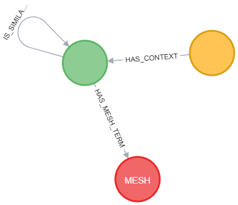
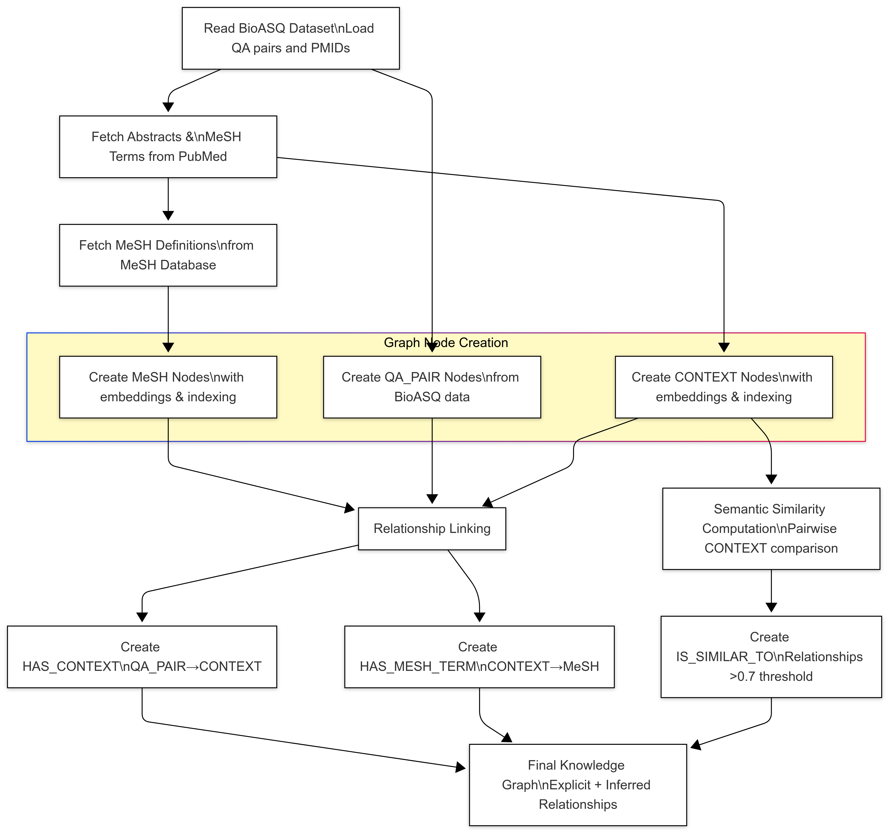
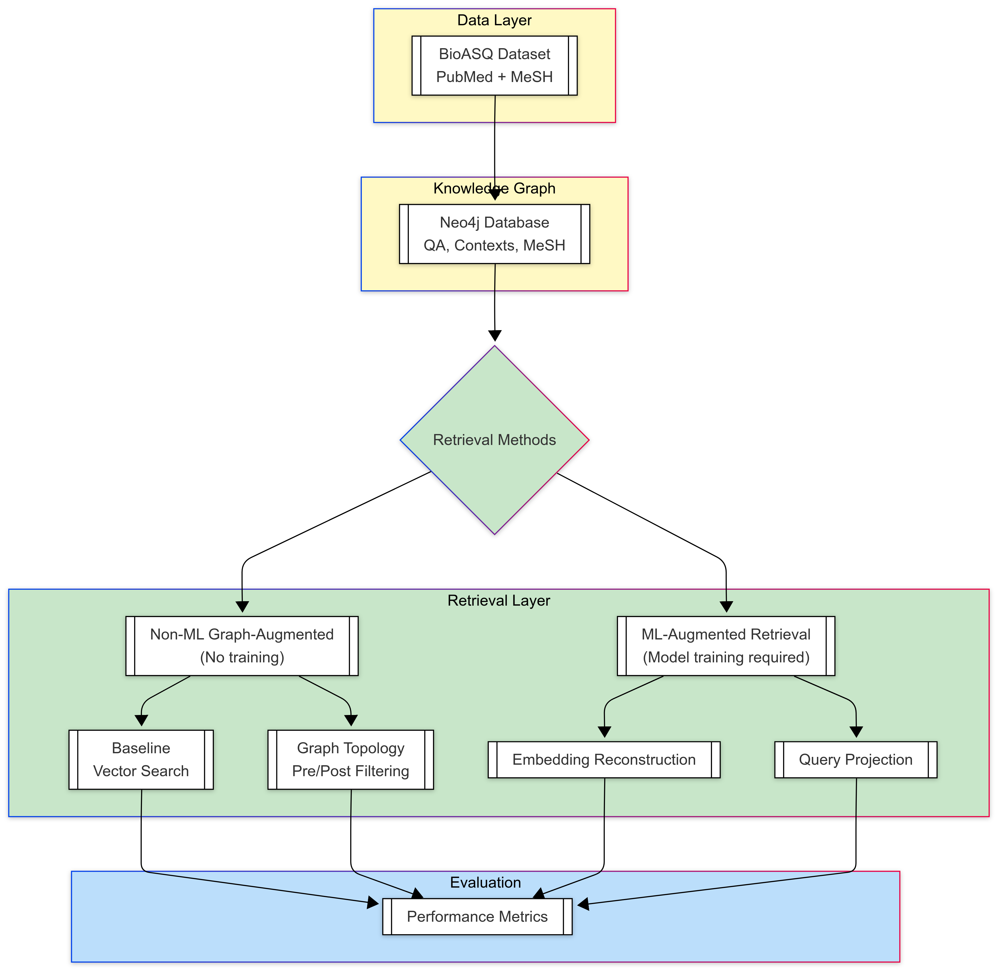
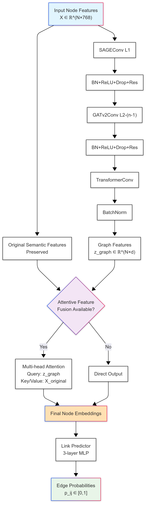

# Graph RAG Techniques

**AUTH Diploma Thesis Project**

Research code for graph-augmented retrieval in biomedical question answering. The project builds a knowledge graph from BioASQ questions, PubMed abstracts and MeSH terms in Neo4j, learns graph embeddings with GNNs, and compares graph-based retrievers against dense-embedding search.

## Repository layout

```
graph_rag_techniques/
├── pyproject.toml          # package metadata, dependencies, tool config (uv / hatchling)
├── uv.lock                 # locked dependency versions
├── .env.example            # environment variables to copy into .env
├── docs/
│   └── images/             # architecture diagrams
├── src/graph_rag/
│   ├── config.py           # environment + data directory configuration
│   ├── utils.py            # JSON IO, token counting, seeding
│   ├── data/               # BioASQ reader, PubMed/MeSH fetchers, dataset builder, chunking
│   ├── graph/              # Neo4j connection, CRUD helpers, graph loader
│   ├── llm/                # embedding model and chat model wrappers
│   ├── gnn/                # homogeneous and heterogeneous GNN encoders, training, inference
│   ├── projection/         # query projection models (dual, GAT, triplet, attentive, adversarial)
│   ├── retrieval/          # retriever interface and all retrieval techniques
│   ├── evaluation/         # IR metrics, retrieval runner, RAGAS evaluation
│   ├── visualization/      # embedding visualizations
│   ├── experiments/        # exploratory scripts (dataset/MeSH exploration, GAE baseline)
│   └── pipelines/          # runnable entry points (graph building, training, evaluation)
└── tests/                  # import smoke tests and metric unit tests
```

Every runnable file lives under `graph_rag.pipelines` or `graph_rag.experiments` and is executed as a module, e.g. `uv run python -m graph_rag.pipelines.build_graph construct`.

## Setup

Requirements: Python 3.10 to 3.12, [uv](https://docs.astral.sh/uv/), and a Neo4j 5 instance with the Graph Data Science plugin (APOC recommended). A CUDA GPU is optional.

```bash
git clone https://github.com/AlexandrosMelis/graph_rag_techniques.git
cd graph_rag_techniques
uv sync                      # creates .venv from uv.lock, including dev tools
cp .env.example .env         # then fill in the values
uv run pytest                # import smoke tests + metric tests
```

### Environment

| Variable | Purpose |
|---|---|
| `ENTREZ_EMAIL` | NCBI Entrez identification for PubMed / MeSH requests |
| `NEO4J_URI`, `NEO4J_USER`, `NEO4J_PASSWORD` | Neo4j connection |
| `NEO4J_PUBMED_DATABASE` | Neo4j database name holding the graph |
| `GOOGLE_API_KEY`, `GROQ_API_KEY` | only for LLM-based evaluation |

### Data

The BioASQ questions come from [`enelpol/rag-mini-bioasq`](https://huggingface.co/datasets/enelpol/rag-mini-bioasq). Place the question parquet files in `data/raw/` as `bioasq_train.parquet` and `bioasq_test.parquet`. PubMed abstracts and MeSH definitions are fetched through NCBI Entrez. Everything under `data/` is generated locally and git-ignored.

## Running

### Build the graph

```bash
uv run python -m graph_rag.pipelines.build_graph construct          # fetch PubMed + MeSH data
uv run python -m graph_rag.pipelines.build_graph load               # write nodes, edges, embeddings to Neo4j
uv run python -m graph_rag.pipelines.build_graph evaluate-baseline  # BERT similarity baseline
```

Graph schema: `QA_PAIR`, `CONTEXT` and `MESH` nodes connected by `HAS_CONTEXT`, `HAS_MESH_TERM` and `IS_SIMILAR_TO`.



### Train models

```bash
uv run python -m graph_rag.pipelines.train_gnn both                 # GNN encoder, then write graph embeddings
uv run python -m graph_rag.pipelines.train_hetero_gnn               # heterogeneous GNN
uv run python -m graph_rag.pipelines.train_dual_projection_neo4j    # dual projection (semantic + graph heads)
uv run python -m graph_rag.pipelines.train_gat_projection           # GAT query projection
uv run python -m graph_rag.pipelines.train_triplet_projection       # triplet-loss projection
uv run python -m graph_rag.pipelines.train_attentive_projection     # attentive-positive projection
uv run python -m graph_rag.pipelines.train_domain_adversarial_projection
```

### Evaluate

```bash
uv run python -m graph_rag.pipelines.evaluate_non_ml                # baseline, N-hop, MeSH subgraph, PPR
uv run python -m graph_rag.pipelines.evaluate_dual_projection
uv run python -m graph_rag.pipelines.evaluate_gat
```

Retrieval metrics: Precision, Recall, F1, MRR, nDCG, MAP, Success and Coverage at k. Results are written to `data/results/`.

### Experiments

```bash
uv run python -m graph_rag.experiments.exploration preview --split train --n 3
uv run python -m graph_rag.experiments.exploration mesh --question "What is the role of IL-6 in inflammation?"
uv run python -m graph_rag.experiments.gae_link_prediction train
uv run python -m graph_rag.experiments.qwen3_embedding_demo
```

## Architecture

### Graph construction



### Implementation overview



### GNN encoder


