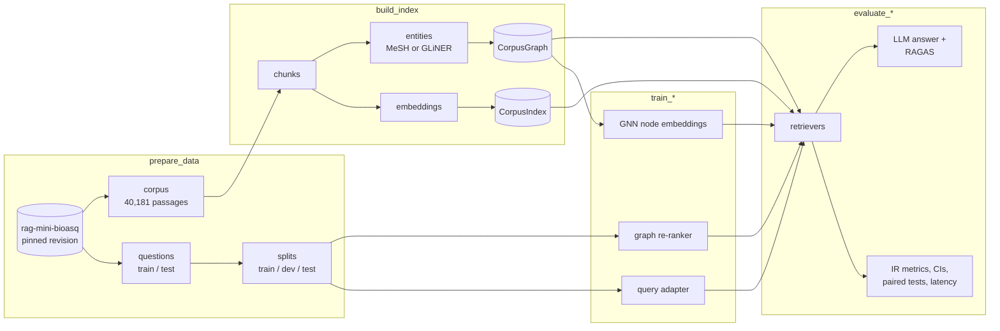
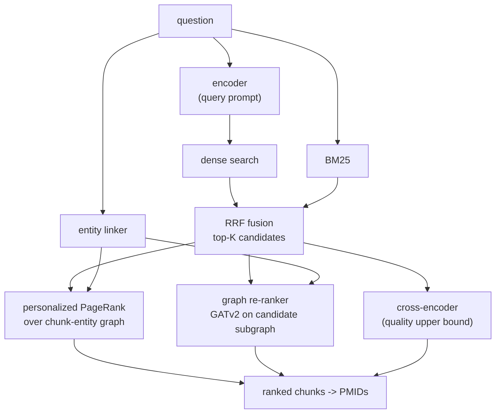
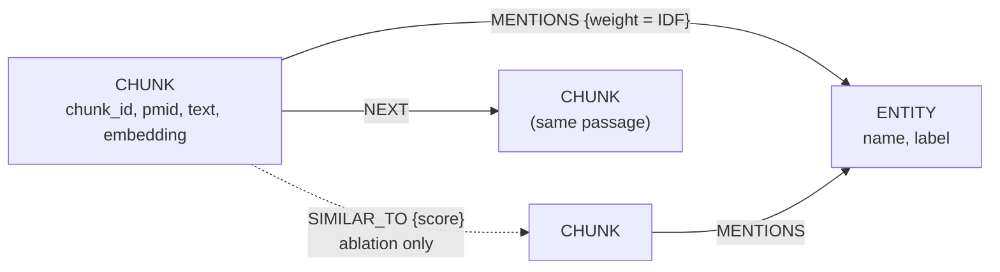
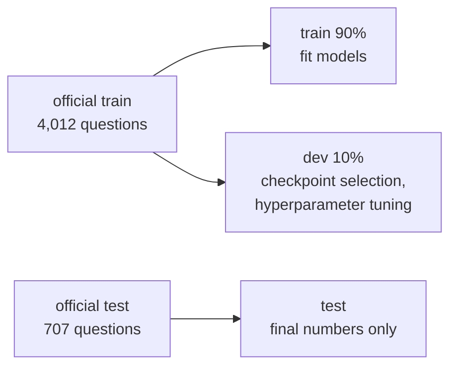
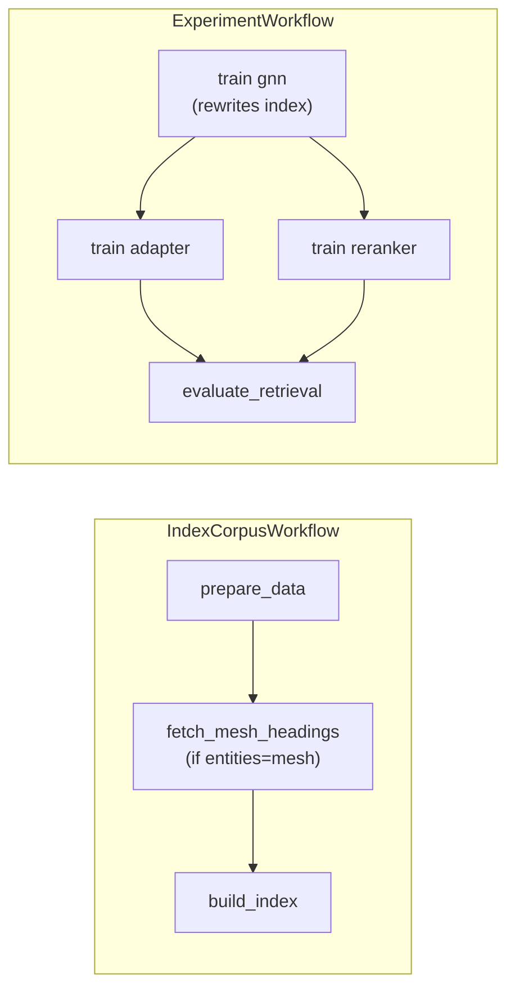

# Graph RAG Techniques

**AUTH Diploma Thesis Project**

Graph-augmented retrieval for biomedical RAG. The question this code is built to answer: *when does a corpus graph improve retrieval over strong dense and lexical search, and what does it cost?*

A graph only helps when its edges carry information the text embedding does not (shared entities, document structure) and when the question needs it (bridging between passages). Everything here is set up to measure that without fooling ourselves: a fixed corpus, question-level splits, no relevance labels anywhere in the index, strong baselines and paired significance tests.

## Status and plan

The repository was rewritten in September 2026. The original implementation could not produce a valid result: the relevance labels were stored in the graph and fed to the models, the projection models were trained on the questions they were evaluated on, the similarity graph was a threshold on the very embeddings the GNN consumed, and the GAT evaluation script returned empty rankings for every query. That code is gone; the ideas that survived (graph at query time, PPR, a learned query mapping) are reimplemented on a leakage-free setup.

What exists now, in three merged pieces:

1. **Structure** (`refactor/repo-structure`): a `src/graph_rag` package, uv lockfile, notebooks turned into modules, import smoke tests.
2. **Method** (`fix/critical-major-issues`): fixed corpus and question-level splits, chunk/entity graph without labels, BM25 / dense / hybrid / cross-encoder baselines, in-process PPR and expansion, an identity-initialised query adapter, a query-conditioned graph re-ranker, an honest GNN pretext task, corrected metrics with paired tests and latency.
3. **Tooling** (`feat/modern-tooling`): `graph-rag` CLI, MLflow tracking and tracing, Temporal workflows for the long runs, Hugging Face Hub sharing, docker compose, pre-commit and CI.

**No experiment has been run with the new code yet.** The full plan, phase by phase with checkboxes, is in [docs/ROADMAP.md](docs/ROADMAP.md). The first phase is the baselines and the RQ0 result on BioASQ; it needs roughly a day of compute on a laptop.

## Research questions

| | Question |
|---|---|
| RQ0 | Do embedding-similarity (kNN) graphs add anything beyond the embedder? Their edges are a function of the node features, so link prediction on them is solved by cosine similarity alone. |
| RQ1 | Which edge types (entity co-mention, same-passage adjacency, kNN) help which queries? |
| RQ2 | Does a query-conditioned graph re-ranker beat training-free propagation (PPR), and how close does it get to a cross-encoder at what latency? |
| RQ3 | Can graph components be trained without human labels and transfer across corpora? (planned) |

## How it works

### Pipeline


```mermaid
flowchart LR
    subgraph data["prepare_data"]
        HF[("rag-mini-bioasq<br/>pinned revision")] --> Q["questions<br/>train / test"]
        HF --> C["corpus<br/>40,181 passages"]
        Q --> S["splits<br/>train / dev / test"]
    end
    subgraph index["build_index"]
        C --> CH["chunks"] --> EMB["embeddings"]
        CH --> ENT["entities<br/>MeSH or GLiNER"]
        EMB --> IDX[("CorpusIndex")]
        ENT --> G[("CorpusGraph")]
    end
    subgraph train["train_*"]
        S --> AD["query adapter"]
        S --> RR["graph re-ranker"]
        G --> GNN["GNN node embeddings"]
    end
    subgraph eval["evaluate_*"]
        IDX --> R["retrievers"]
        G --> R
        AD --> R
        RR --> R
        GNN --> R
        R --> M["IR metrics, CIs,<br/>paired tests, latency"]
        R --> RAG["LLM answer +<br/>RAGAS"]
    end
```

The index and graph live in memory as NumPy / SciPy arrays, so a query never waits on a database. Neo4j is an optional export for exploring and visualizing the graph.

### Query time


```mermaid
flowchart TD
    q["question"] --> enc["encoder<br/>(query prompt)"]
    q --> bm25["BM25"]
    q --> link["entity linker"]
    enc --> dense["dense search"]
    dense --> rrf["RRF fusion<br/>top-K candidates"]
    bm25 --> rrf
    rrf --> ppr["personalized PageRank<br/>over chunk-entity graph"]
    link --> ppr
    rrf --> gr["graph re-ranker<br/>GATv2 on candidate subgraph"]
    link --> gr
    rrf --> ce["cross-encoder<br/>(quality upper bound)"]
    ppr --> out["ranked chunks -> PMIDs"]
    gr --> out
    ce --> out
```

The graph re-ranker builds a small graph over the K candidates, with edges from shared entities and same-passage adjacency. Its node inputs depend on the query (q ⊙ d, dense score, first-stage rank, linked-entity coverage), so message passing spreads relevance between related candidates. Candidates are built the same way at training and inference time, and gold labels are only training targets.

### Corpus graph


```mermaid
flowchart LR
    c1["CHUNK<br/>chunk_id, pmid, text, embedding"] -- "MENTIONS {weight = IDF}" --> e1["ENTITY<br/>name, label"]
    c2["CHUNK"] -- MENTIONS --> e1
    c1 -- NEXT --> c3["CHUNK<br/>(same passage)"]
    c1 -. "SIMILAR_TO {score}<br/>ablation only" .-> c2
```

There are no question nodes and no relevance edges: questions and their gold passages exist only in the split files. Each (chunk, entity) pair is stored once. Entities that appear in more than 5% of chunks are dropped because they connect everything, and so are MeSH check tags such as *Humans*.

### Evaluation protocol


```mermaid
flowchart LR
    otr["official train<br/>4,012 questions"] --> tr["train 90%<br/>fit models"]
    otr --> dv["dev 10%<br/>checkpoint selection,<br/>hyperparameter tuning"]
    ote["official test<br/>707 questions"] --> te["test<br/>final numbers only"]
```

- The corpus is the dataset's own passage collection and doesn't depend on which questions are evaluated. Every run reports the recall ceiling, which is the share of gold passages present in the index.
- Retrieval is scored per PMID. Chunk hits collapse to the passage's best rank.
- Metrics are Recall, Precision, nDCG, MRR, MAP, Success and Coverage at k, with bootstrap confidence intervals, paired bootstrap tests against a baseline, and p50/p95 latency.
- A retriever error stops the run instead of being scored as an empty result.

## Retrievers

| Name | What it does | Training |
|---|---|---|
| `bm25` | BM25 over chunk text (bm25s) | none |
| `dense` | cosine search over chunk embeddings | none |
| `hybrid` | BM25 + dense with reciprocal rank fusion | none |
| `hybrid_ce` | hybrid, re-ranked by a cross-encoder (default `ncbi/MedCPT-Cross-Encoder`) | none |
| `dense_adapter` | dense with a low-rank residual query adapter (identity at init, ~98k params) | train split |
| `ppr` | personalized PageRank over the chunk-entity graph, seeded by hybrid hits and query entities | tuned on dev |
| `expand` | hybrid, then relevance propagation to graph neighbours | tuned on dev |
| `entity` | dense search restricted to chunks mentioning query entities | tuned on dev |
| `graph_reranker` | query-conditioned GATv2 over the hybrid candidates | train split |
| `graph_space` | search in GNN node-embedding space through a graph-space adapter (RQ0) | train split |

## Repository layout

```
graph_rag_techniques/
├── pyproject.toml / uv.lock      # dependencies (uv), `graph-rag` entry point, tool config
├── docker-compose.yml            # Temporal, MLflow, optional Neo4j
├── .pre-commit-config.yaml       # ruff, uv lock check, hygiene hooks
├── .github/workflows/ci.yml      # lint + tests on every PR
├── docs/ROADMAP.md               # status and the phase-by-phase plan
├── src/graph_rag/
│   ├── cli.py                    # `graph-rag` command line
│   ├── config.py                 # typed settings (pydantic-settings, .env)
│   ├── tracking.py               # MLflow runs, metrics and artifacts
│   ├── hub.py                    # Hugging Face Hub push/pull of trained artifacts
│   ├── pipelines/                # prepare_data, build_index, training, evaluation run() functions
│   ├── orchestration/            # Temporal workflows, activities, worker, client
│   ├── data/                     # dataset download, splits, chunking, PubMed client, entity extraction
│   ├── index/                    # CorpusIndex, CorpusGraph, entity linker
│   ├── retrieval/                # retrievers + factory (named retrievers, dev tuning)
│   ├── models/                   # query adapter, graph re-ranker, losses
│   ├── gnn/                      # GNN node encoder (link prediction) for the RQ0 experiments
│   ├── evaluation/               # metrics, runner, paired tests, traced RAG answerer, RAGAS
│   ├── graph/                    # Neo4j connection and exporter (exploration only)
│   ├── llm/                      # embedding model, cross-encoder, chat models
│   ├── visualization/            # t-SNE of text vs graph embeddings
│   └── experiments/              # exploration helpers
└── tests/                        # offline tests (toy corpus, fake encoder, local Temporal server)
```

## Setup

Requirements: Python 3.10 to 3.12, [uv](https://docs.astral.sh/uv/), and Docker for the optional services. A GPU (CUDA or Apple MPS) speeds up embedding but isn't required.

```bash
uv sync                          # add `--extra entities` for GLiNER
cp .env.example .env             # ENTREZ_EMAIL is needed for MeSH entities
uv run pre-commit install        # ruff + lockfile checks on commit
uv run pytest
docker compose up -d             # Temporal (UI :8233) and MLflow (UI :5050); `--profile neo4j` adds Neo4j
```

The pipelines run without any of the services: tracking falls back to a local SQLite MLflow store under `data/mlflow/`, and Temporal is only used by the `workflow` commands.

## Running

Everything goes through the `graph-rag` CLI (`uv run graph-rag --help`). Training options can be overridden with `-p key=value`.

```bash
# 1. data: pinned download + train/dev/test splits
uv run graph-rag data prepare

# 2. index: chunks, embeddings, entity graph (MeSH via NCBI Entrez, cached and resumable)
uv run graph-rag index build --entities mesh
#    other embedders: --embedding-model Qwen/Qwen3-Embedding-0.6B -p query_prompt_name=query
#    RQ0 ablation edges: --knn-k 10      general-domain entities: --entities gliner

# 3. learned components (train split, checkpoint picked on dev)
uv run graph-rag train adapter -p epochs=20
uv run graph-rag train reranker --edge-types entity,next
uv run graph-rag train gnn --edge-types entity      # RQ0: compare with --edge-types knn

# 4. evaluation (use --split dev while iterating; test once at the end)
uv run graph-rag evaluate retrieval --split dev \
    --retrievers bm25,dense,hybrid,dense_adapter,ppr,graph_reranker
uv run graph-rag evaluate retrieval --split test --tune \
    --retrievers dense,hybrid,hybrid_ce,dense_adapter,ppr,expand,entity,graph_reranker
uv run graph-rag evaluate rag --retriever hybrid --n 50
```

Results go to `data/results/<run>/`: `summary.md` (comparison table), one `*_summary.json` per retriever (metrics, confidence intervals, latency, recall ceiling, paired test against the baseline) and per-query CSVs.

`train gnn` prints the zero-parameter baseline next to the GNN, i.e. the AUC of cosine(x_i, x_j) on the same held-out edges. On kNN edges that baseline is about 1.0, and the GNN can't learn anything the embedding didn't already contain.

### Experiment tracking (MLflow)

Every command opens an MLflow run with its parameters, per-epoch metrics, final metrics and outputs as artifacts; `evaluate retrieval` logs one nested run per retriever. `evaluate rag` also records traces: a retrieval span with the retrieved passages and the LLM calls (LangChain autolog), so bad answers can be traced back to the passages behind them.

```bash
export MLFLOW_TRACKING_URI=http://localhost:5050   # docker compose server; unset = local SQLite
```

### Durable runs (Temporal)

Long jobs (hours of rate-limited NCBI calls, corpus embedding, training) run as Temporal workflows. A crashed or restarted worker resumes at the failed step, activities heartbeat their progress, and configuration errors fail fast instead of retrying.


```mermaid
flowchart LR
    subgraph IndexCorpusWorkflow
        p["prepare_data"] --> m["fetch_mesh_headings<br/>(if entities=mesh)"] --> b["build_index"]
    end
    subgraph ExperimentWorkflow
        g["train gnn<br/>(rewrites index)"] --> a["train adapter"]
        g --> r["train reranker"]
        a --> e["evaluate_retrieval"]
        r --> e
    end
```

```bash
uv run graph-rag workflow worker                       # keep running; one per machine
uv run graph-rag workflow index -p entities=mesh --wait
uv run graph-rag workflow experiment --train gnn,adapter,reranker --split dev --wait
```

Progress is visible in the Temporal UI at http://localhost:8233.

### Sharing models (Hugging Face Hub)

```bash
uv run graph-rag hub push data/models/query_adapter_semantic <user>/graph-rag-adapter   # private by default
uv run graph-rag evaluate retrieval --retrievers dense_adapter --adapter hf://<user>/graph-rag-adapter
```

`push` writes a model card from the saved config and dev results. Any model directory option accepts `hf://<user>/<repo>[@revision]`.

## Environment

| Variable | Needed for |
|---|---|
| `ENTREZ_EMAIL`, `ENTREZ_API_KEY` (optional, raises the rate limit) | `index build --entities mesh`, `index fetch-mesh` |
| `NEO4J_URI`, `NEO4J_USER`, `NEO4J_PASSWORD`, `NEO4J_DATABASE` | `index build --export-neo4j` |
| `GOOGLE_API_KEY` / `GROQ_API_KEY` | `evaluate rag` |
| `MLFLOW_TRACKING_URI`, `GRAPH_RAG_MLFLOW_EXPERIMENT`, `GRAPH_RAG_TRACKING` | tracking server, experiment name, on/off |
| `TEMPORAL_ADDRESS`, `TEMPORAL_NAMESPACE`, `TEMPORAL_TASK_QUEUE` | `workflow` commands |
| `HF_TOKEN` | `hub push` and private `hf://` artifacts |
| `GRAPH_RAG_DATA_DIR` | where data, indexes, models and results live (default `./data`) |

## Data

Questions and passages come from [`enelpol/rag-mini-bioasq`](https://huggingface.co/datasets/enelpol/rag-mini-bioasq) (CC BY 2.5), pinned to a fixed revision. MeSH headings come from PubMed through NCBI Entrez. Everything under `data/` is generated locally and git-ignored.
